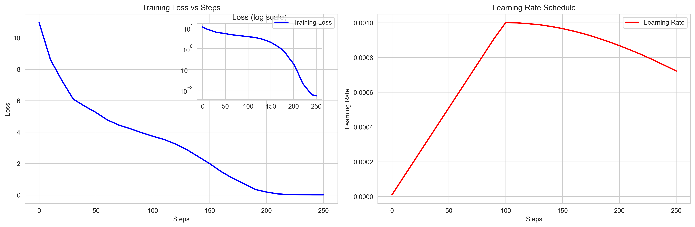

# NanoGPT Training Implementation

A PyTorch implementation of GPT-2 style transformer with modern training optimizations. This implementation follows the architecture described in the GPT-2 paper while incorporating various performance enhancements for efficient training.

**HuggingFace Demo**: [https://huggingface.co/spaces/dhairyashil/ShakespeareGPT-Forge](https://huggingface.co/spaces/dhairyashil/ShakespeareGPT-Forge)

## Training Curves 



## Features

### Architecture
- GPT-2 style transformer architecture
- Flash Attention for optimized performance
- Configurable model sizes (matches GPT-2 small/medium/large/xl configurations)
- Pre-norm transformer blocks with residual connections
- Weight sharing between input embeddings and output layer

### Training Optimizations
- Mixed precision training (automatic mixed precision)
- Gradient accumulation for effective larger batch sizes
- Cosine learning rate scheduling with warmup
- Fused AdamW optimizer when available
- Gradient clipping for stability
- High precision matrix multiplications
- Efficient batched data loading

### Key Components
- CausalSelfAttention with Flash Attention
- Configurable feed-forward network (4x expansion)
- Layer normalization with pre-norm formulation
- Positional embeddings
- Token embeddings shared with output layer

## Configuration

Default hyperparameters (GPT-2 Small):
```python
block_size: 1024 # Maximum sequence length
vocab_size: 50304 # GPT-2 vocabulary size
n_layer: 12 # Number of transformer blocks
n_head: 12 # Number of attention heads
n_embd: 768 # Embedding dimension
```

Training parameters:
```python
max_lr: 1e-3 # Maximum learning rate
min_lr: 1e-4 # Minimum learning rate
warmup_steps: 100 # Learning rate warmup steps
max_steps: 500 # Total training steps
gradient_accumulation_steps: 4 # Gradient accumulation
batch_size: 32 # Training batch size
context_length: 1024 # Training sequence length
```

## Model Summary
```bash
==================================================

Total Parameters: 124,475,904
Trainable Parameters: 124,475,904
Non-trainable Parameters: 0

Layer Details:
--------------------------------------------------
transformer: ModuleDict (124,475,904 parameters)
  └─wte: Embedding (38,633,472 parameters)
  └─wpe: Embedding (786,432 parameters)
  └─h: ModuleList (85,054,464 parameters)
    └─Transformer Blocks:
      └─Block 0: (7,087,872 parameters)
      └─Block 1: (7,087,872 parameters)
      └─Block 2: (7,087,872 parameters)
      └─Block 3: (7,087,872 parameters)
      └─Block 4: (7,087,872 parameters)
      └─Block 5: (7,087,872 parameters)
      └─Block 6: (7,087,872 parameters)
      └─Block 7: (7,087,872 parameters)
      └─Block 8: (7,087,872 parameters)
      └─Block 9: (7,087,872 parameters)
      └─Block 10: (7,087,872 parameters)
      └─Block 11: (7,087,872 parameters)
  └─ln_f: LayerNorm (1,536 parameters)
lm_head: Linear (38,633,472 parameters)

Model Architecture:
--------------------------------------------------
GPT(
  (transformer): ModuleDict(
    (wte): Embedding(50304, 768)
    (wpe): Embedding(1024, 768)
    (h): ModuleList(
      (0-11): 12 x Block(
        (ln_1): LayerNorm((768,), eps=1e-05, elementwise_affine=True)
        (attn): CausalSelfAttention(
          (c_attn): Linear(in_features=768, out_features=2304, bias=True)
          (c_proj): Linear(in_features=768, out_features=768, bias=True)
        )
        (ln_2): LayerNorm((768,), eps=1e-05, elementwise_affine=True)
        (mlp): MLP(
          (c_fc): Linear(in_features=768, out_features=3072, bias=True)
          (gelu): GELU(approximate='tanh')
          (c_proj): Linear(in_features=3072, out_features=768, bias=True)
        )
      )
    )
    (ln_f): LayerNorm((768,), eps=1e-05, elementwise_affine=True)
  )
  (lm_head): Linear(in_features=768, out_features=50304, bias=False)
)
==================================================
```

Training is done by running the `gpt.py` script. The log file is `log.md`.
```bash
Starting training...

step 0 | loss: 10.9677 | dt: 25213.31ms | tok/sec: 5198.52 | norm: 6.74 | lr: 0.000010
step 10 | loss: 8.6117 | dt: 19315.15ms | tok/sec: 6785.97 | norm: 2.93 | lr: 0.000110
step 20 | loss: 7.2877 | dt: 19741.21ms | tok/sec: 6639.51 | norm: 1.46 | lr: 0.000210
step 30 | loss: 6.1021 | dt: 20774.12ms | tok/sec: 6309.39 | norm: 3.34 | lr: 0.000310
step 40 | loss: 5.6547 | dt: 19595.06ms | tok/sec: 6689.03 | norm: 1.76 | lr: 0.000410
step 50 | loss: 5.2481 | dt: 19507.46ms | tok/sec: 6719.07 | norm: 2.19 | lr: 0.000510
step 60 | loss: 4.7766 | dt: 19275.92ms | tok/sec: 6799.78 | norm: 1.11 | lr: 0.000610
step 70 | loss: 4.4516 | dt: 20078.69ms | tok/sec: 6527.92 | norm: 1.37 | lr: 0.000710
step 80 | loss: 4.2195 | dt: 19304.38ms | tok/sec: 6789.76 | norm: 1.38 | lr: 0.000810
step 90 | loss: 3.9687 | dt: 19132.26ms | tok/sec: 6850.84 | norm: 1.47 | lr: 0.000910
step 100 | loss: 3.7358 | dt: 19418.34ms | tok/sec: 6749.91 | norm: 1.94 | lr: 0.001000
step 110 | loss: 3.5271 | dt: 18674.47ms | tok/sec: 7018.78 | norm: 2.02 | lr: 0.000999
step 120 | loss: 3.2398 | dt: 20031.85ms | tok/sec: 6543.18 | norm: 2.23 | lr: 0.000994
step 130 | loss: 2.8777 | dt: 19001.86ms | tok/sec: 6897.85 | norm: 1.91 | lr: 0.000988
step 140 | loss: 2.4371 | dt: 19741.29ms | tok/sec: 6639.48 | norm: 2.08 | lr: 0.000978
step 150 | loss: 1.9901 | dt: 19080.45ms | tok/sec: 6869.44 | norm: 2.15 | lr: 0.000966
step 160 | loss: 1.4909 | dt: 19663.16ms | tok/sec: 6665.86 | norm: 1.87 | lr: 0.000951
step 170 | loss: 1.0689 | dt: 20061.77ms | tok/sec: 6533.42 | norm: 2.10 | lr: 0.000934
step 180 | loss: 0.7128 | dt: 19673.48ms | tok/sec: 6662.37 | norm: 1.50 | lr: 0.000914
step 190 | loss: 0.3486 | dt: 18985.32ms | tok/sec: 6903.86 | norm: 1.00 | lr: 0.000892
step 200 | loss: 0.1825 | dt: 19363.12ms | tok/sec: 6769.16 | norm: 0.78 | lr: 0.000868
step 210 | loss: 0.0650 | dt: 19188.05ms | tok/sec: 6830.92 | norm: 0.38 | lr: 0.000842
step 220 | loss: 0.0208 | dt: 19753.06ms | tok/sec: 6635.53 | norm: 0.10 | lr: 0.000815
step 230 | loss: 0.0110 | dt: 19126.73ms | tok/sec: 6852.82 | norm: 0.11 | lr: 0.000785
step 240 | loss: 0.0059 | dt: 18788.09ms | tok/sec: 6976.33 | norm: 0.03 | lr: 0.000754
step 250 | loss: 0.0052 | dt: 18931.22ms | tok/sec: 6923.59 | norm: 0.08 | lr: 0.000722
```
## Usage

1. Prepare your training data in a file named `input.txt`. The current file here contains Shakespeare's works.

2. Run the training script:
```bash
python gpt.py
```

3. The script will:
   - Initialize the model
   - Print detailed model summary
   - Start training with progress updates
   - Save the best model checkpoint

## Requirements

- PyTorch >= 2.0
- tiktoken (for GPT-2 tokenization)
- CUDA-capable GPU (recommended)

## Model Checkpointing

The implementation automatically saves model checkpoints when:
- A new best loss is achieved
- The checkpoint includes:
  - Model state
  - Optimizer state
  - Current loss
  - Training step

## Performance Monitoring

The training loop provides detailed metrics:
- Loss values
- Training speed (tokens/second)
- Batch processing time
- Gradient norms
- Learning rates


